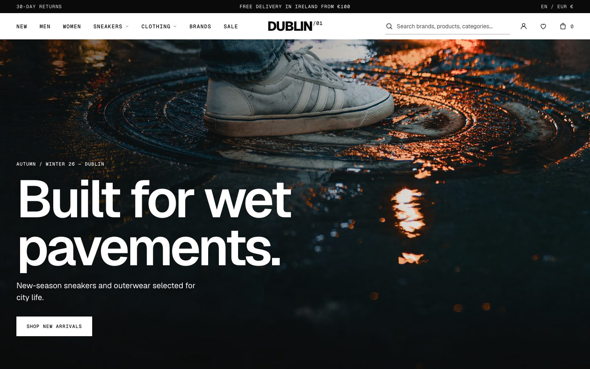
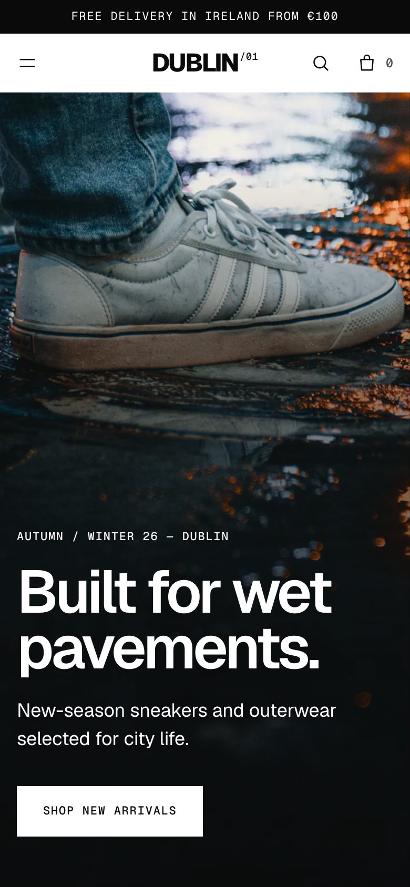
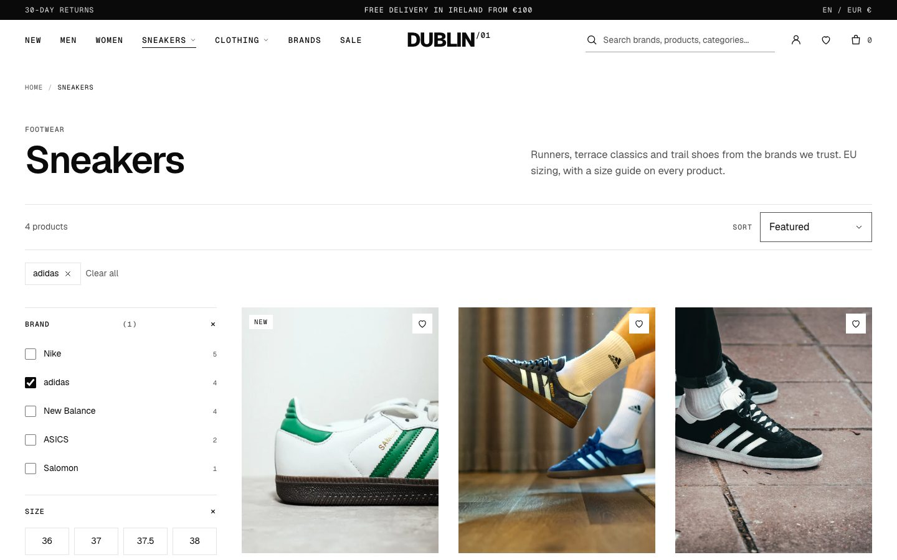
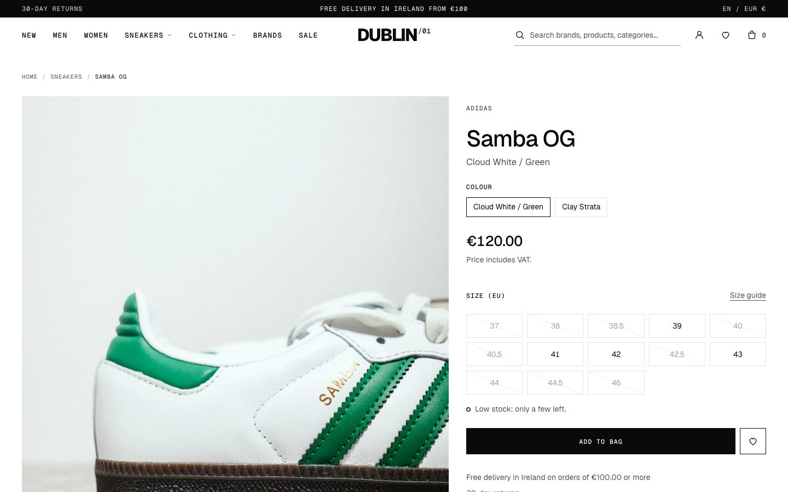

# DUBLIN/01

**Premium Streetwear E-Commerce — Front-End Portfolio Project.**

DUBLIN/01 is a complete storefront interface for a fictional sneaker and streetwear brand inspired by Dublin, Ireland. It is a front-end project: every page, interaction and state is real and testable in the browser, and nothing behind it pretends to be a server.

> **Demo notice.** DUBLIN/01 is not a trading business. The brand is fictional, and product names, prices, stock levels, delivery terms, returns policy and VAT wording are illustrative data. No order is taken, no payment is processed and no personal data leaves the browser.

## Overview

The project sets out to show what a finished e-commerce front end involves beyond the home page: a catalogue that filters and sorts, product pages with real size logic, a bag that persists, honest empty and error states, accessible controls, and a codebase another developer can pick up.

The visual identity is deliberately restrained: black and white, one typeface family (Geist Sans and Geist Mono, self-hosted), square controls, editorial photography and generous whitespace. Editorial blocks ("Rain is the dress code.", "After the last tram.") alternate with commerce sections so the home page does not read as a product grid.

## Screenshots

| Home (desktop) | Home (mobile) |
| --- | --- |
|  |  |

| Catalogue with filters | Product page |
| --- | --- |
|  |  |

## Features

- **Home page**: announcement bar, sticky navigation with mega menus, automatic hero carousel (pauses on hover and keyboard focus, no autoplay with reduced motion), new arrivals, editorial campaigns, categories, featured products, brand list, service information, newsletter and footer.
- **Catalogue**: pages for New, Men, Women, Sneakers, Clothing, Accessories, Running & trail, Sale, plus one page per brand. Filters (brand, size, category, gender, colour, price, type, style, availability, collection) and sorting are stored in the URL, so results can be shared and survive back/forward navigation. Mobile filter drawer.
- **Search**: instant results in the header and a results page, over names, brands, categories, colours and keywords, with an empty state.
- **Product pages**: gallery, colourway links, size selection with per-size availability, size guide, add to bag, wishlist, description, details, materials, delivery and returns, related products. One static page per product with its own title, description and structured data.
- **Quick add** from product cards: a size must be chosen; nothing is added with an arbitrary size.
- **Bag**: drawer and page, quantity limits per size, removal, subtotal, delivery threshold, empty state, persistence across reloads and tabs.
- **Wishlist**: toggle from any card or product page, counter in the header, dedicated page, persistence.
- **Recently viewed** products on the home page.
- **Checkout interface**: five steps for an Irish address (county list, Eircode check, delivery options). The final button is disabled and labelled as unavailable in the demo.
- **Account pages** (sign in, register, password reset): forms validate, then state that accounts are unavailable in the demo. No session is faked.
- **Newsletter and contact forms**: validation and an honest message that nothing was sent or stored.
- **Cookie consent**: banner and settings dialog with equal-weight Accept and Reject, choice remembered with its date.
- **Information pages**: delivery, returns, consumer rights, privacy, terms, cookies, accessibility, size guide, FAQ, each carrying the demo notice.

## Tech Stack

| Layer | Technology |
| --- | --- |
| Markup | Static HTML generated by a Node script (`scripts/build-html.mjs`) from page templates and partials |
| Styles | Tailwind CSS 4 (CLI), design tokens in `src/css/theme.css` |
| Behaviour | Vanilla JavaScript, native ES modules, no framework and no bundler |
| Data | JSON files (`src/data`), `localStorage` for bag, wishlist, history and consent |
| Tooling | Node.js ≥ 20, `node --test`, `serve`, `concurrently` |

There is no React, Next.js or TypeScript in this repository, and no runtime dependency: the four packages in `package.json` are development tools.

## Getting Started

Requires Node.js 20 or later.

```bash
npm install
npm run dev
```

Then open http://localhost:3001.

| Script | What it does |
| --- | --- |
| `npm run dev` | Rebuilds pages and CSS on save and serves the site on port 3001 |
| `npm run build` | Generates all pages and the minified stylesheet |
| `npm run preview` | Builds, then serves |
| `npm run lint` | Syntax check of every JavaScript module |
| `npm test` | Runs the automated tests |
| `npm run check` | Lint, build and tests in sequence |

## Project Structure

```
dublin01-ecommerce/
├── scripts/build-html.mjs     # Page generator: templates + partials + data → HTML
├── src/
│   ├── pages/                 # One template per page (front matter: title, description, script)
│   ├── templates/             # Product and brand page templates
│   ├── partials/              # layout, header, footer, catalog, info-head
│   ├── css/                   # theme, base, typography, layout, components, header, commerce
│   ├── js/
│   │   ├── main.js            # Shared entry: header, search, bag, wishlist, consent, newsletter
│   │   ├── config.js          # Company fields, commerce values, feature flags
│   │   ├── data/              # catalog.js (product access, search), search-source.js
│   │   ├── modules/           # carousel, cart, bag-drawer, quick-add, wishlist, search, consent…
│   │   ├── pages/             # One module per page type (home, catalog, product, bag, checkout…)
│   │   └── utils/             # dom, dialog, storage, format, paths, forms
│   └── data/                  # products.json, site.json (navigation), campaigns.json (hero)
├── public/                    # Images (with CREDITS.md), fonts, icons
├── tests/                     # node:test suites
├── docs/                      # API contract, pricing notes, reports, screenshots
├── index.html, *.html         # Generated pages (do not edit by hand)
├── products/, brands/         # Generated product and brand pages
└── pages/                     # Redirects from an earlier URL scheme
```

## Testing

```bash
npm run check
```

runs the syntax check, the build and the automated tests:

- **Catalogue integrity**: required fields, unique ids and slugs, image files present, size and inventory consistency, price format.
- **Search and cart logic**: ranking, quantity limits per size, totals, inclusive free-delivery threshold.
- **Generated site**: every internal link, image, script and stylesheet resolves; every page has a language, unique title, description and a single `h1`; images have alternative text and dimensions; controls have accessible names; no page is orphaned.

Browser-level checks (customer journeys, responsive widths, Lighthouse) were run with Chrome during development and are recorded, with their limits, in [`DUBLIN01_FRONTEND_FINAL_REPORT.md`](DUBLIN01_FRONTEND_FINAL_REPORT.md). There is no TypeScript type check and no ESLint configuration in this project.

## Architecture

- **Build-time HTML.** The header and footer exist once, in `src/partials`. Each product and brand gets its own static page with metadata and JSON-LD, so URLs are real files and refreshing a nested route always works.
- **Single source of product data.** `src/data/products.json` feeds the generator and the browser. `src/js/data/catalog.js` documents the `Product` type (JSDoc) and is the only module that reads the file; cards, search, bag and product pages all go through it, so a price is never written twice.
- **Small modules, one job each.** `product-card.js` renders every card; `bag-lines.js` is shared by the bag page and the bag drawer; `cart.js` and `wishlist.js` own their `localStorage` keys and emit change events the header listens to.
- **URL as state.** Catalogue filters and sorting live in the query string.
- **Ready for an API.** [`docs/api-contract.md`](docs/api-contract.md) lists, for each future endpoint, the single front-end module that would change.

## Limitations

- **No back end.** Authentication, payment processing, server-side inventory, orders, emails and newsletter delivery are not connected. The interface says so wherever it matters and never simulates a successful order, payment or sign-in.
- **`localStorage` is not a database.** Bag, wishlist and history live in the visitor's browser only.
- **Illustrative commerce data.** Prices, stock, the free-delivery threshold (€100 or more), delivery charges, the 30-day returns policy and VAT-inclusive pricing are demo assumptions, not verified business terms. Policy pages are summaries written for the interface, not legal advice.
- **Third-party brands.** Nike, adidas, New Balance, ASICS and Salomon are referenced for demonstration only. There is no affiliation, partnership or endorsement.
- **Photography.** Images come from Unsplash and are credited in [`public/images/CREDITS.md`](public/images/CREDITS.md). They are demonstration visuals; commercial usage rights for a real shop have not been established.
- **Testing scope.** Verified in Chrome (Chromium). Firefox, Safari and physical devices have not been tested, and no screen-reader audit has been carried out.
- **Client-rendered listings.** Product grids are rendered in the browser from the JSON file.

## Future Improvements

- A back end for products, inventory, carts, orders and accounts, following `docs/api-contract.md`.
- Payment through a provider's hosted fields.
- Server-side or build-time rendering of product listings.
- French interface (locale files are in place, switching is not implemented).
- Cross-browser and assistive-technology testing, automated browser tests in CI.

## Author

**Alfred Donald KRODI**

## Project Status

Front-End Portfolio Project — 2026.
